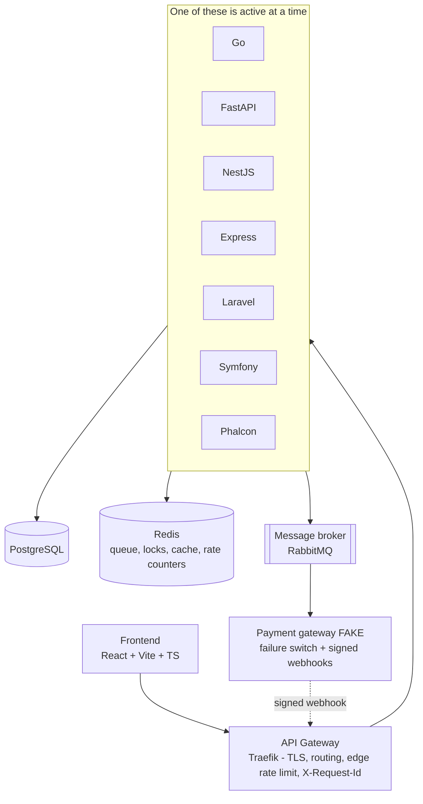

# Architecture

One system, many backends, one frontend that has no idea which backend it is talking
to and likes it that way.

## The big picture



The frontend talks to exactly one host: the gateway. Which backend answers is a
routing decision made in infra, not a line of code in the frontend. That is the
whole trick, and everything in this repo is arranged to keep it true.

## Layers inside every backend

Every backend, regardless of language, has the same shape. Only the idiom changes.

```
HTTP handler / controller   thin: parse, validate, call, serialize. No business logic.
        |
        v
use case / service          all the rules live here, testable without a web server
        |
        v
repository (port)           an interface. The domain depends on this, not on a driver.
        |
        v
adapter                     concrete Postgres / Redis / broker implementation, injected
```

Rules:
- Business rules never leak upward into a controller or downward into an adapter.
- The use case depends on a repository interface (a port). The Postgres adapter
  implements it. Dependency inversion, applied for real, not just cited in a standup.
- You can unit-test a use case with in-memory fakes and no Docker running.

The star of the show is the reservation use case: idempotency guard, distributed
lock, atomic stock decrement, TTL hold. It is deliberately the most heavily
documented and tested path in each backend, because it is where every hard concept
in the checklist shows up at once.

## Cross-cutting contract rules

Enforced identically everywhere, defined once in `/contract/openapi.yaml`:

- Every mutating endpoint accepts an `Idempotency-Key` header.
- Every response carries an `X-Request-Id` header for tracing.
- Errors use one envelope: `{ "error": { "code", "message", "request_id" } }`.
  Internal details and stack traces stay on the inside where they belong.
- Listings paginate by cursor, not by `offset`, because `offset` under a moving
  dataset is a lie told slowly.

## Where each concept lives

| Concept | Home |
|---|---|
| Virtual queue, distributed locks, hot cache, rate counters | Redis |
| Async payment, domain events | RabbitMQ |
| Circuit breaker / retry / timeout demo | Backend <-> fake payment gateway |
| TLS, edge rate limit, request-id injection, backend routing | API Gateway |
| Persistence, migrations, read/write split | PostgreSQL |
| Metrics, traces, logs, dashboards | OpenTelemetry, Prometheus, Grafana, Loki |
| Proof of no overselling under load | k6 scenarios in `/infra/load` |

See `docs/domain-model.md` for entities and state machines, and `docs/adr/` for
why things are the way they are.
