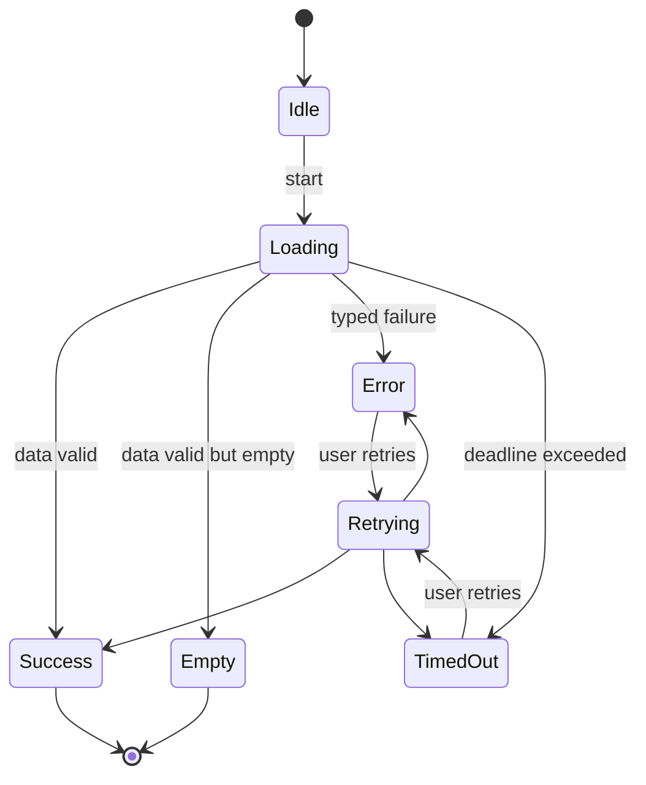
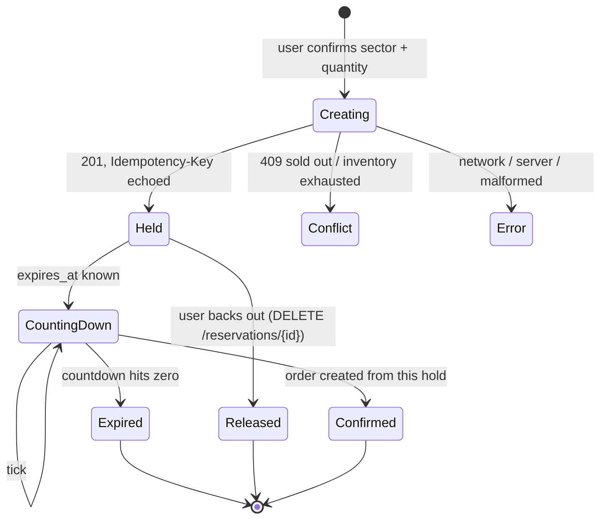
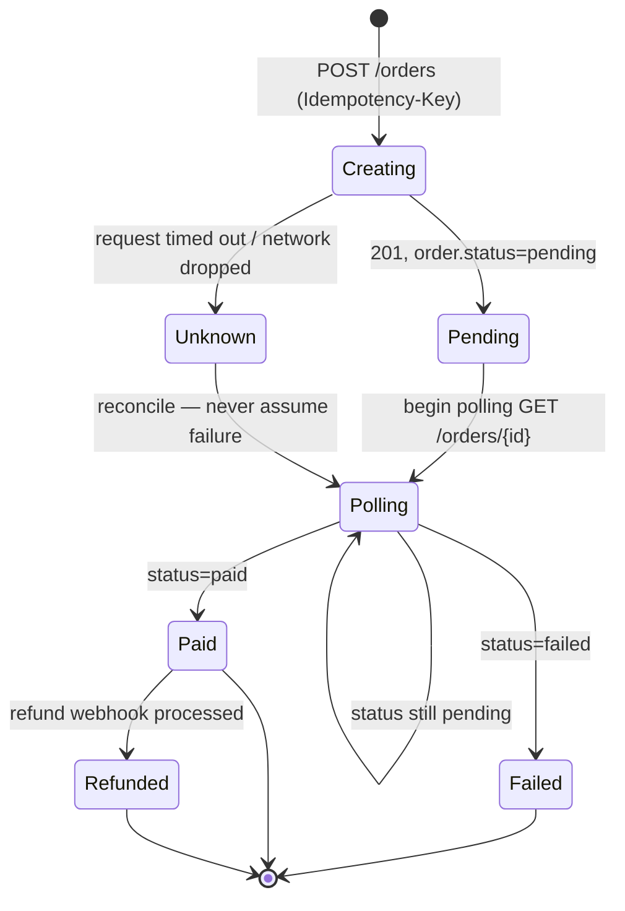

# Client state machines

The apps are state machines wearing a UI. Two of them are worth drawing: the reservation
hold and the order lifecycle. Both are modelled identically in all three apps; only the
syntax differs.

There is also the generic async-operation state, which wraps every network call.

## Async operation (every network call)

Every call resolves into exactly one of these. Nothing is inferred from a stray null.

`Error` always carries a typed error (see [`shared/copy/errors.json`](../shared/copy/errors.json)),
a `request_id` from the response, a message, and a recovery affordance. `TimedOut` is
kept distinct from `Error` because "the server said no" and "the server said nothing"
call for different words and, for payment, different behaviour entirely.

## Reservation hold

A hold is a promise with a stopwatch attached. It is created with an `Idempotency-Key`
so a double-tap cannot create two, and it expires on its own if checkout is too slow.

`status` maps to the contract's `Reservation.status` enum: `held | confirmed | released
| expired`. `Creating` and `CountingDown` are client-side refinements the server does
not name. The double-tap defence lives entirely in `Creating`: the second tap reuses the
same `Idempotency-Key` and gets the same reservation back.

## Order lifecycle

The order is where the money is, so this is where the care goes. The server owns
`pending | paid | failed | refunded`. The client adds one state the server never sends:
`Unknown`, for when a request times out and the outcome is genuinely unresolved.

The crucial edge is `Creating --> Unknown --> Polling`. A timeout does **not** go to
`Failed`. It goes to `Unknown`, and the only way out is polling until the server states
an outcome. Because the create carried an `Idempotency-Key`, any retry is safe. This is
the `payment-unknown-outcome` scenario, and it is the difference between a lab and a
liability.

`Failed` is terminal from the app's side (recover by starting a new order). `Paid` can
still move to `Refunded` if a refund arrives later. A delayed webhook simply means
`Polling` runs longer; the app does not give up early.
