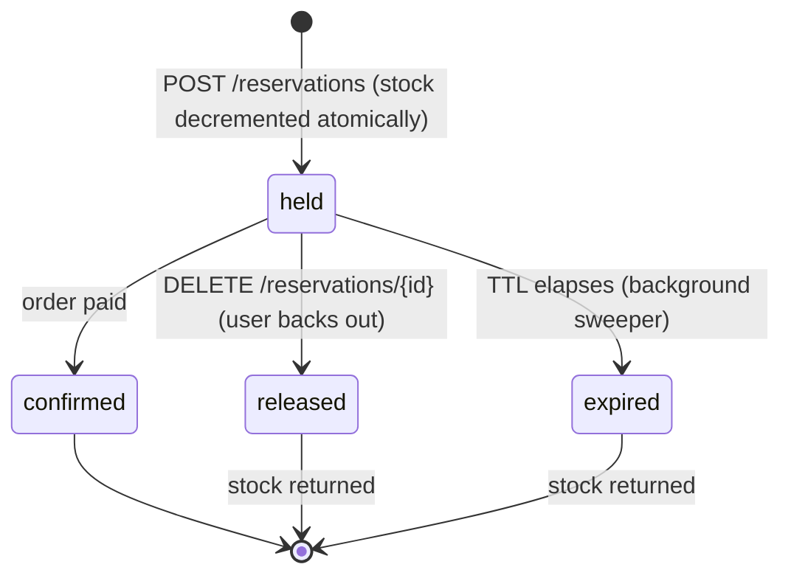
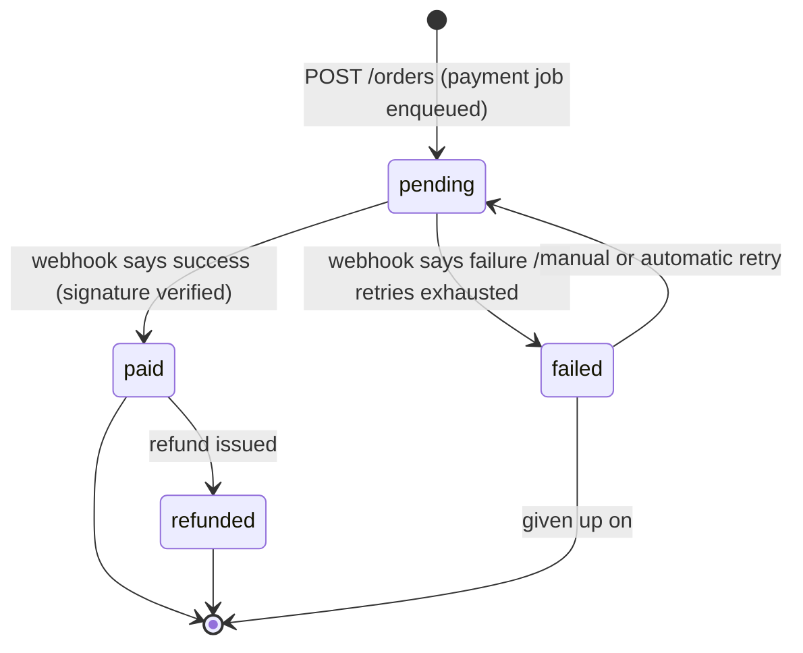

# Domain model

The whole point of this lab is that the domain is identical in every language. The
controllers change, the swagger changes, the smug tribal opinions about dependency
injection change. The domain does not. Below is the one true model. If a backend
disagrees with this document, the backend is wrong.

The domain is a flash sale: a popular event goes on sale, far more people show up
than there are tickets, and everyone tries to buy at the same second. That single
sentence is why this project needs a virtual queue, distributed locks, idempotency,
a TTL on held stock, and asynchronous payment. Nothing here is decoration.

## Entities

Field names are `snake_case` because that is what the API speaks. How each language
stores them internally is its own business.

### User
| field | type | notes |
|---|---|---|
| `id` | uuid | |
| `email` | string | unique |
| `password_hash` | string | argon2id or bcrypt, never plaintext, never logged |
| `role` | enum | `customer` \| `admin` |
| `created_at` | timestamptz | |

### Event
| field | type | notes |
|---|---|---|
| `id` | uuid | |
| `name` | string | |
| `venue` | string | |
| `starts_at` | timestamptz | when the show starts |
| `sales_open_at` | timestamptz | when the stampede starts |
| `status` | enum | `draft` \| `on_sale` \| `sold_out` \| `closed` |

### Sector
| field | type | notes |
|---|---|---|
| `id` | uuid | |
| `event_id` | uuid | FK -> Event |
| `name` | string | e.g. "Pista", "Camarote" |
| `price_cents` | integer | money in cents, because floats and money are a bad marriage |
| `currency` | string | ISO 4217, e.g. `BRL` |
| `total_inventory` | integer | fixed capacity |
| `available_inventory` | integer | the number everyone is fighting over |

### QueueToken
| field | type | notes |
|---|---|---|
| `id` | uuid | |
| `user_id` | uuid | FK -> User |
| `event_id` | uuid | FK -> Event |
| `position` | integer | place in line |
| `status` | enum | `waiting` \| `admitted` \| `expired` |
| `admitted_at` | timestamptz | null until admitted |

### Reservation
| field | type | notes |
|---|---|---|
| `id` | uuid | |
| `user_id` | uuid | FK -> User |
| `sector_id` | uuid | FK -> Sector |
| `quantity` | integer | how many seats are held |
| `status` | enum | `held` \| `confirmed` \| `released` \| `expired` |
| `expires_at` | timestamptz | when the hold evaporates |
| `idempotency_key` | string | unique per user; the anti-double-click device |

### Order
| field | type | notes |
|---|---|---|
| `id` | uuid | |
| `reservation_id` | uuid | FK -> Reservation |
| `user_id` | uuid | FK -> User |
| `amount_cents` | integer | |
| `status` | enum | `pending` \| `paid` \| `failed` \| `refunded` |
| `created_at` | timestamptz | |

### Payment
| field | type | notes |
|---|---|---|
| `id` | uuid | |
| `order_id` | uuid | FK -> Order |
| `provider_ref` | string | reference from the fake gateway |
| `status` | enum | `pending` \| `succeeded` \| `failed` |
| `attempts` | integer | retries with backoff live here |

## Invariants

These hold in every backend, under load, forever. They are the acceptance criteria
the load test exists to break.

1. **`available_inventory` never goes negative.** No overselling. Enforced by an
   atomic conditional update and/or a distributed lock, never by reading then
   writing and hoping.
2. **A `held` reservation reserves stock for a TTL.** When it expires, the stock
   returns to `available_inventory`. Nobody gets to squat on a seat forever.
3. **Same `Idempotency-Key`, same result.** Re-sending a reservation or order
   request with an already-seen key returns the original resource. It does not
   create a second one. Double-clicks are a fact of life, not an exception.
4. **No queue token, no checkout.** A user only reaches `/reservations` if their
   `QueueToken` for that event is `admitted`. The waiting room is the pressure
   valve for the whole system.

## Reservation state machine

A reservation is a short-lived promise: "this stock is yours if you pay in time."

Notes:
- `held -> confirmed` is the only path that keeps the stock. Every other exit
  returns it to the sector.
- `released` and `expired` are functionally identical for inventory; they differ
  only in who pulled the trigger (the user vs the clock).
- There is no path back out of a terminal state. A released reservation is gone;
  the user queues again like everyone else.

## Order state machine

An order is the money side. It is created optimistically and settled asynchronously,
which is why the API returns `202 Accepted` and the client polls.

Notes:
- The transition into `paid` or `failed` is driven by the payment webhook, whose
  signature is verified. An unsigned webhook changes nothing; it gets a `401` and
  a stern look.
- `pending -> failed -> pending` is where retry-with-backoff and the circuit
  breaker earn their keep, because the fake gateway can be told to fail on demand.
- A `paid` order flips its reservation to `confirmed`. That is the one place the
  two state machines touch.
